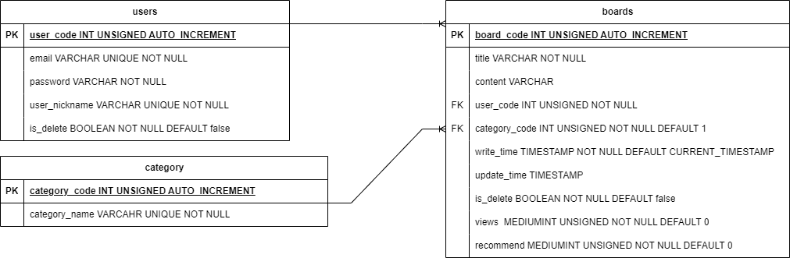

# MySQL_database_document

## ERD

## TABLE( SQL Query )

### users
- 명세서

| 컬럼명        | 데이터 타입     | 제약조건                  | 기본값   | 필드설명     | 특이사항             |
|---------------|----------------|--------------------------|---------|-------------|----------------------|
| user_code     | INT UNSIGNED   | PRIMARY KEY              |         | 유저코드     | AUTO_INCREMENT      |
| email         | VARCHAR(100)   | UNIQUE, NOT NULL         |         | 유저이메일   |                      |
| password      | VARCHAR(50)    | NOT NULL                 |         | 유저비밀번호 |                      |
| user_nickname | VARCHAR(20)    | UNIQUE, NOT NULL         |         | 유저이름     |                      |
| is_delete     | BOOLEAN        | NOT NULL                 | FALSE   | 탈퇴여부     | TRUE일 시 탈퇴로 간주 |

- SQL 
<pre><code>-- users TABLE
CREATE TABLE users (
    user_code INT UNSIGNED AUTO_INCREMENT PRIMARY KEY,
    email VARCHAR(100) UNIQUE NOT NULL,
    password VARCHAR(50) NOT NULL,
    user_nickname VARCHAR(20) UNIQUE NOT NULL,
    is_delete BOOLEAN NOT NULL DEFAULT false 
);

-- INSERT example
INSERT INTO users (email, password, user_nickname) VALUES ('example@email.com', 'password123', 'exampleUser');</code></pre>

### boards

- 명세서

| 컬럼명        | 데이터 타입         | 제약조건                  | 기본값             | 필드설명     | 특이사항                           |
|---------------|--------------------|--------------------------|-------------------|--------------|-----------------------------------|
| board_code    | INT UNSIGNED       | PRIMARY KEY              |                   | 게시글코드    | AUTO_INCREMENT                    |
| title         | VARCHAR(30)        | NOT NULL                 |                   | 게시글 제목   |                                   |
| content       | TEXT               |                          |                   | 게시글 내용   |                                   |
| user_code     | INT UNSIGNED       | FORIGEN KEY, NOT NULL    |                   | 작성자의 코드 | users 테이블의 user_code를 참조함   |
| category_code | INT UNSIGNED       | FORIGEN KEY, NOT NULL    | 1                 | 카테고리      | category 테이블의 category_code를 참조함 / 1일 경우 '자유' 카테고리 |
| write_time    | TIMESTAMP          | NOT NULL                 | CURRENT_TIMESTAMP | 작성일자      |                                  |
| update_time   | TIMESTAMP          |                          |                   | 수정일자      |                                  |
| is_delete     | BOOLEAN            | NOT NULL                 | FALSE             | 삭제여부      | TRUE일 경우 삭제로 간주            |
| views         | MEDIUMINT UNSIGNED | NOT NULL                 | 0                 | 조회수        |                                  |
| recommend     | MEDIUMINT UNSIGNED | NOT NULL                 | 0                 | 추천수        |                                  |                 

- SQL
<pre><code>-- boards TABLE
CREATE TABLE boards (
	board_code INT UNSIGNED AUTO_INCREMENT PRIMARY KEY,
    title VARCHAR(30) NOT NULL,
    content TEXT,
    user_code INT UNSIGNED NOT NULL,
    category_code INT UNSIGNED NOT NULL DEFAULT 1,
    write_time TIMESTAMP NOT NULL DEFAULT CURRENT_TIMESTAMP,
    update_time TIMESTAMP,
    is_delete BOOLEAN NOT NULL DEFAULT false,
    views MEDIUMINT UNSIGNED NOT NULL DEFAULT 0,
    recommend MEDIUMINT UNSIGNED NOT NULL DEFAULT 0,
	FOREIGN KEY (user_code) REFERENCES users (user_code) ON UPDATE CASCADE,
    FOREIGN KEY (category_code) REFERENCES category (category_code) ON DELETE CASCADE
);

-- INSERT example
INSERT INTO boards (title, content, user_code, category_code) VALUES ('exampleTitle', 'exampleContent', 1,1);</code></pre>

### category

- 명세서

| 컬럼명        | 데이터 타입       | 제약조건     | 기본값 | 필드설명           | 특이사항       |
|---------------|------------------|-------------|-------|-------------------|----------------|
| category_code | TINYINT UNSIGNED | PRIMARY KEY |       | 카테고리의 고유코드 | AUTO_INCREMENT |
| category_name | VARCHAR(30)      | UNIQUE      |       | 카테고리명         |                |

- SQL
<pre><code>-- category TABLE
CREATE TABLE category(
	category_code TINYINT UNSIGNED AUTO_INCREMENT PRIMARY KEY,
	category_name VARCHAR(30) UNIQUE NOT NULL
);

-- INSERT example
INSERT INTO category(category_name) VALUES ('자유');</code></pre>